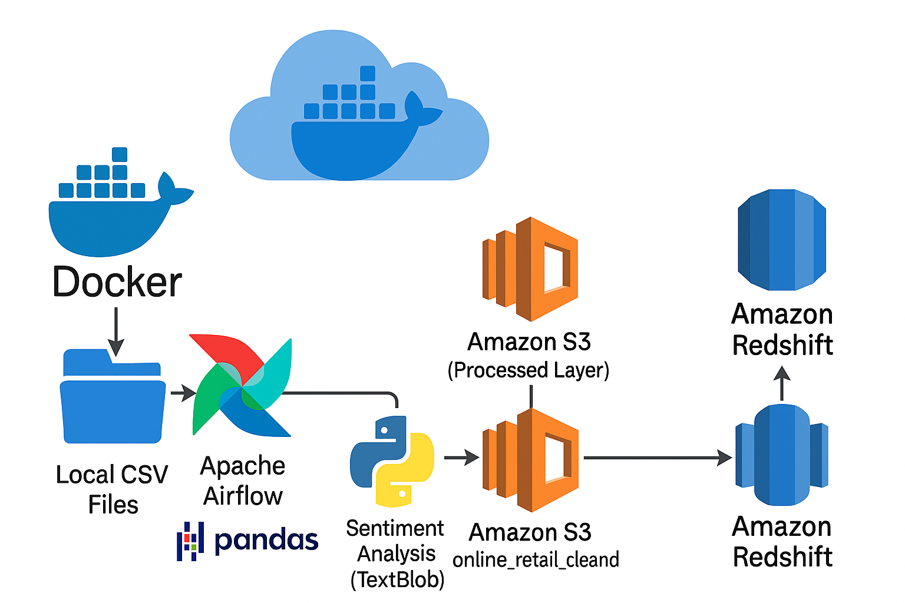
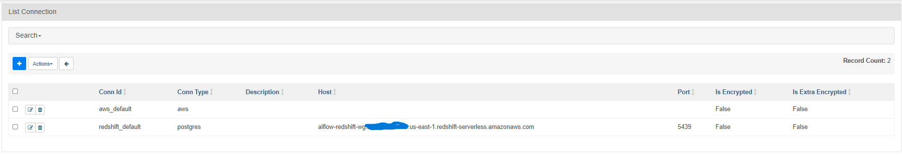
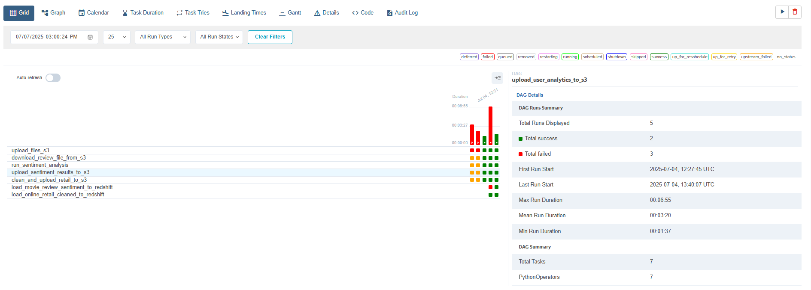
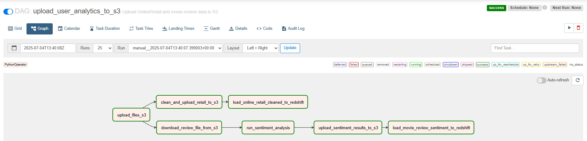
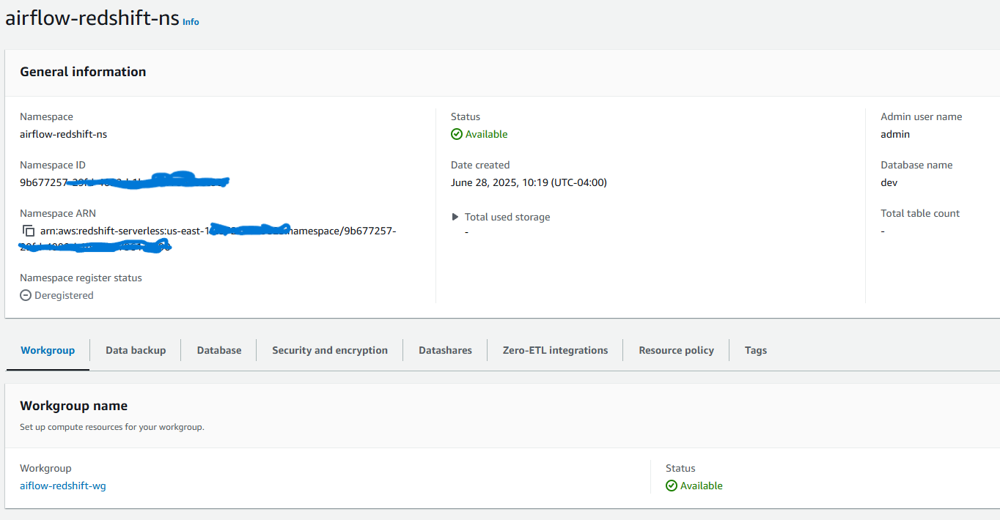
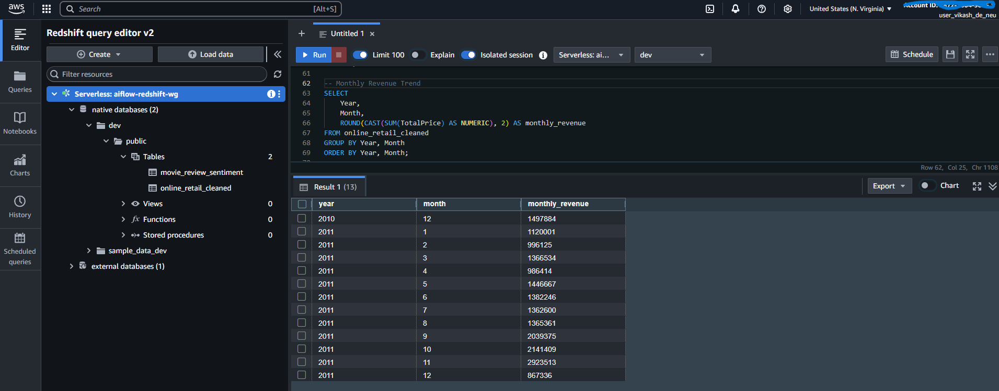
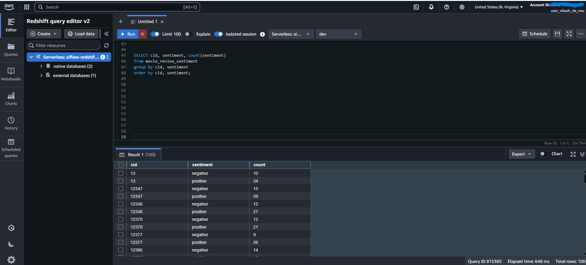
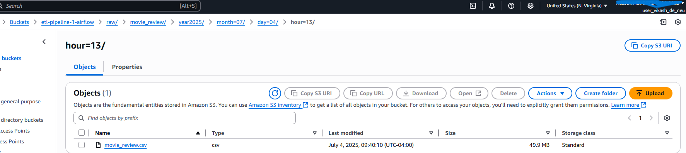
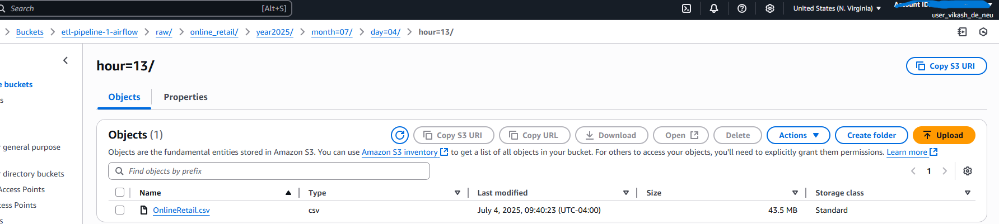
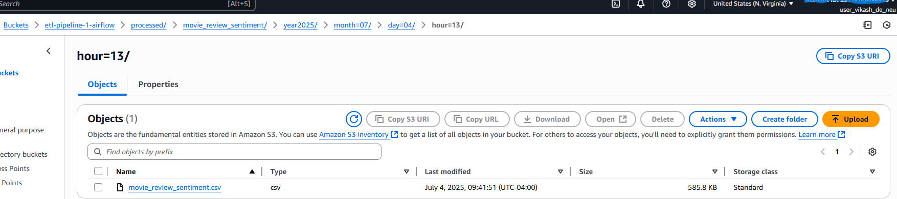

# 🛒 Retail Data Pipeline

An end-to-end data pipeline for sentiment analysis and retail sales insights using modern data engineering tools.

## Architecture Diagram



## 🚀 Tech Stack

- **Python**
- **Apache Airflow**
- **Docker**
- **Amazon S3**
- **Amazon Redshift**
- **Pandas**, **TextBlob**

## 📦 Project Structure

```
retail-data-pipeline/
├── dags/ # Airflow DAG definitions
│ └── upload_user_analytics_to_s3.py
├── data/ # Raw input data (movie reviews, retail data)
│ └── OnlineRetail.csv
│ └── movie_review.csv
├── scripts/ # Transformation and sentiment analysis scripts
│ ├── transform_retail.py
│ └── sentiment_analysis.py
├── Dockerfile # Airflow container base
├── docker-compose.yaml # Multi-service Docker setup
├── requirements.txt # Python dependencies (if needed)
└── README.md
```


## 🔄 Pipeline Overview

The pipeline includes the following key components:

1. **Raw Data Upload to S3**  
   - Uploads movie reviews and online retail data from local files to S3 with partitioned folder structure.

2. **Movie Review Sentiment Analysis**  
   - Downloads movie review CSV from S3.
   - Performs sentiment analysis using `TextBlob`.
   - Uploads the resulting sentiment-labeled data to S3 (processed path).

3. **Retail Data Transformation**  
   - Cleans and processes the `OnlineRetail.csv` file using pandas.
   - Adds derived fields (e.g., `TotalPrice`, `Year`, `Month`, etc.)
   - Saves and uploads cleaned data to S3 (processed path).

4. **Amazon Redshift Ingestion**  
   - Loads processed sentiment and retail data from S3 into Amazon Redshift using `COPY` commands.

## 🧠 DAG Logic

```
upload_files_s3
│
├── download_review_file_from_s3
│ └── run_sentiment_analysis
│ └── upload_sentiment_results_to_s3
│ └── load_movie_review_sentiment_to_redshift
│
└── clean_and_upload_retail_to_s3
└── load_online_retail_cleaned_to_redshift

```


## 🛠️ Setup Instructions

### 1. Clone the Repository

```bash
git clone https://github.com/your-username/retail-data-pipeline.git
cd retail-data-pipeline
```

### 2. Requirements

```
Docker + Docker Compose

AWS account with:

An S3 bucket (used: etl-pipeline-1-airflow)

A Redshift cluster/serverless and IAM role with S3 read permissions

Python 3.8+ (for local testing)
```

### 3. Run the Project Locally with Airflow

```
# Start Airflow containers
docker-compose up --build

# Access the Airflow UI at: http://localhost:8080
Login with default creds: airflow / airflow
 ```

###  4. Trigger the DAG

```
In the Airflow UI, trigger upload_user_analytics_to_s3 manually
```

## 📂 Data Files
```
data/OnlineRetail.csv

data/movie_review.csv
```

## 📜 Key Scripts

```
scripts/transform_retail.py: Cleans and engineers features from raw retail data

scripts/sentiment_analysis.py: Applies sentiment analysis on customer reviews
```


## 📥 Outputs
### S3:

Raw files stored under raw/<source>/year=.../month=.../...

Processed files under processed/<dataset>/...

### Amazon Redshift:
```
movie_review_sentiment

online_retail_cleaned
```

## 📸 Execution Snapshots

### 🔄 Airflow DAG - Connections




### 📅 Airflow Execution History



### 🔄 Airflow DAG - Graph View




### 🧮 Redshift Query Results







### ☁️ S3 File Structure








